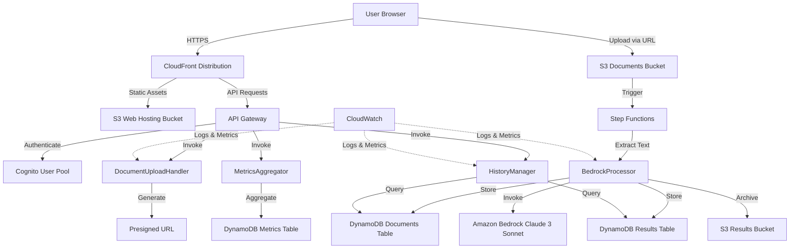

# Design Document: Document Analysis with Bedrock on AWS

## Overview

This document describes the technical design for a serverless document analysis system built entirely on AWS. The system enables authenticated users to upload documents (PDF, DOCX, TXT), process them using Amazon Bedrock with Claude 3 Sonnet, and receive intelligent analysis based on industry-specific templates.

The architecture follows AWS best practices for serverless applications, utilizing managed services to minimize operational overhead while maximizing scalability, security, and cost-efficiency.

### Key Design Principles

1. **Serverless-First**: All components use managed AWS services (Lambda, S3, DynamoDB, API Gateway)
2. **Event-Driven**: Processing flows triggered by S3 events and orchestrated by Step Functions
3. **Security by Design**: Encryption at rest and in transit, least privilege IAM, JWT authentication
4. **Scalability**: Auto-scaling components handle variable workloads without manual intervention
5. **Observability**: Comprehensive logging and monitoring via CloudWatch
6. **Cost Optimization**: Pay-per-use model with appropriate service tier selection

## Architecture

### High-Level Architecture Diagram




### Architecture Layers

**Presentation Layer (Frontend)**
- React 18+ with TypeScript
- Hosted on S3 as static website
- Distributed via CloudFront for global low-latency access
- Communicates with backend via API Gateway REST API

**API Layer**
- API Gateway REST API with Cognito authorizer
- Endpoints: /upload, /analyze, /history, /metrics, /export
- Request validation and throttling
- CORS configuration for frontend domain

**Authentication Layer**
- Cognito User Pool for user management
- JWT token-based authentication
- Optional MFA support
- Hosted UI for login/registration

**Processing Layer**
- Step Functions orchestrate document processing workflow
- Lambda functions for business logic
- Bedrock for AI-powered document analysis
- S3 for document storage and archival

**Data Layer**
- DynamoDB tables for structured data (documents, results, metrics)
- S3 buckets for unstructured data (files, exports)
- Encryption at rest for all data stores

**Monitoring Layer**
- CloudWatch Logs for all Lambda executions
- CloudWatch Metrics for custom application metrics
- CloudWatch Alarms for operational alerts
- CloudWatch Dashboard for unified view

## Components and Interfaces

### Frontend Components

#### 1. Authentication Module
**Responsibility**: Handle user authentication flows

**Components**:
- `LoginPage`: Cognito Hosted UI integration or custom login form
- `RegisterPage`: User registration with email verification
- `AuthContext`: React Context for authentication state management
- `ProtectedRoute`: HOC for route protection

**Interfaces**:
```typescript
interface AuthService {
  login(username: string, password: string): Promise<AuthTokens>
  register(email: string, password: string): Promise<void>
  logout(): Promise<void>
  getCurrentUser(): Promise<User | null>
  refreshToken(): Promise<AuthTokens>
}

interface AuthTokens {
  idToken: string
  accessToken: string
  refreshToken: string
}

interface User {
  userId: string
  email: string
  emailVerified: boolean
}
```


#### 2. Document Upload Module
**Responsibility**: Handle file selection, validation, and upload

**Components**:
- `DocumentUploader`: Drag-and-drop file upload component
- `VerticalSelector`: Industry vertical selection dropdown
- `UploadProgress`: Progress bar with percentage
- `FileValidator`: Client-side file validation

**Interfaces**:
```typescript
interface UploadService {
  getPresignedUrl(fileName: string, fileType: string): Promise<PresignedUrlResponse>
  uploadToS3(presignedUrl: string, file: File, onProgress: (percent: number) => void): Promise<void>
  notifyUploadComplete(documentId: string): Promise<void>
}

interface PresignedUrlResponse {
  uploadUrl: string
  documentId: string
  expiresIn: number
}

interface DocumentMetadata {
  documentId: string
  fileName: string
  fileSize: number
  fileType: string
  vertical: Vertical
  uploadedAt: string
}

type Vertical = 'healthcare' | 'education' | 'retail' | 'legal' | 'finance' | 'manufacturing' | 'hr' | 'technology'
```

#### 3. Analysis Results Module
**Responsibility**: Display analysis results in structured format

**Components**:
- `ResultsCard`: Container for analysis display
- `ExecutiveSummary`: Prominent summary section
- `KeyPointsList`: Bulleted list with icons
- `NextStepsList`: Numbered action items
- `ExportButton`: Multi-format export options

**Interfaces**:
```typescript
interface AnalysisResult {
  documentId: string
  vertical: Vertical
  executiveSummary: string
  keyPoints: string[]
  nextSteps: string[]
  analyzedAt: string
  processingTimeMs: number
}

interface ExportService {
  exportToPDF(documentId: string): Promise<Blob>
  exportToJSON(documentId: string): Promise<Blob>
  exportToExcel(documentId: string): Promise<Blob>
  exportToWord(documentId: string): Promise<Blob>
}
```

#### 4. Dashboard Module
**Responsibility**: Display metrics and KPIs

**Components**:
- `DashboardPage`: Main dashboard container
- `KPICard`: Individual metric display
- `DocumentsChart`: Time-series chart
- `VerticalDistribution`: Pie chart for vertical usage

**Interfaces**:
```typescript
interface DashboardMetrics {
  totalDocuments: number
  averageProcessingTime: number
  favoriteVertical: Vertical
  documentsThisWeek: number
  documentsThisMonth: number
  documentsByVertical: Record<Vertical, number>
  documentsByDate: Array<{ date: string; count: number }>
}

interface MetricsService {
  getUserMetrics(userId: string): Promise<DashboardMetrics>
}
```


#### 5. History Module
**Responsibility**: Display and search document history

**Components**:
- `HistoryPage`: Main history container
- `DocumentTable`: Paginated table with sorting
- `SearchBar`: Text search input
- `FilterPanel`: Vertical and date filters
- `DocumentDetailModal`: Full analysis view

**Interfaces**:
```typescript
interface HistoryService {
  getDocuments(userId: string, filters: DocumentFilters, pagination: Pagination): Promise<DocumentPage>
  getDocumentById(documentId: string): Promise<DocumentWithAnalysis>
}

interface DocumentFilters {
  searchQuery?: string
  vertical?: Vertical
  dateFrom?: string
  dateTo?: string
  status?: DocumentStatus
}

interface Pagination {
  page: number
  pageSize: number
}

interface DocumentPage {
  documents: DocumentMetadata[]
  totalCount: number
  page: number
  pageSize: number
}

type DocumentStatus = 'pending' | 'processing' | 'completed' | 'failed'

interface DocumentWithAnalysis extends DocumentMetadata {
  analysis?: AnalysisResult
  status: DocumentStatus
  errorMessage?: string
}
```

### Backend Components

#### 1. DocumentUploadHandler Lambda
**Responsibility**: Generate presigned URLs for S3 uploads and create document records

**Runtime**: Node.js 20.x or Python 3.12
**Memory**: 256 MB
**Timeout**: 10 seconds

**Handler Logic**:
1. Validate JWT token from API Gateway authorizer
2. Extract user ID from token
3. Validate file metadata (type, size)
4. Generate unique document ID (UUID)
5. Create presigned S3 URL with 15-minute expiration
6. Create document record in DynamoDB with status 'pending'
7. Return presigned URL and document ID

**Environment Variables**:
- `DOCUMENTS_BUCKET_NAME`: S3 bucket for document storage
- `DOCUMENTS_TABLE_NAME`: DynamoDB table name
- `PRESIGNED_URL_EXPIRATION`: URL expiration in seconds (900)

**IAM Permissions**:
- `s3:PutObject` on documents bucket
- `dynamodb:PutItem` on documents table


#### 2. BedrockProcessor Lambda
**Responsibility**: Extract text from documents and invoke Bedrock for analysis

**Runtime**: Python 3.12
**Memory**: 1024 MB
**Timeout**: 300 seconds (5 minutes)

**Dependencies**:
- `boto3`: AWS SDK
- `PyPDF2` or `pdfplumber`: PDF text extraction
- `python-docx`: DOCX text extraction

**Handler Logic**:
1. Receive document metadata from Step Functions
2. Download document from S3
3. Extract text based on file type:
   - PDF: Use PyPDF2 or pdfplumber
   - DOCX: Use python-docx
   - TXT: Read directly
4. Load vertical-specific template from configuration
5. Construct prompt with template and extracted text
6. Invoke Bedrock with Claude 3 Sonnet model
7. Parse JSON response from Bedrock
8. Store results in DynamoDB and S3
9. Update document status to 'completed'
10. Return processing summary

**Prompt Template Structure**:
```python
PROMPT_TEMPLATE = """
You are an expert analyst specializing in {vertical} industry.

Analyze the following document and provide:
1. Executive Summary (2-3 paragraphs)
2. Key Points (5-7 bullet points)
3. Next Steps (3-5 actionable recommendations)

{vertical_specific_instructions}

Document Content:
{document_text}

Respond ONLY with valid JSON in this exact format:
{{
  "executive_summary": "...",
  "key_points": ["...", "...", "..."],
  "next_steps": ["...", "...", "..."]
}}
"""
```

**Vertical-Specific Instructions**:
- Healthcare: Focus on patient outcomes, compliance (HIPAA), medical terminology
- Education: Focus on learning outcomes, curriculum alignment, student engagement
- Retail: Focus on sales performance, inventory, customer experience
- Legal: Focus on contract terms, compliance, risk assessment
- Finance: Focus on financial metrics, risk analysis, regulatory compliance
- Manufacturing: Focus on operations efficiency, quality control, supply chain
- HR: Focus on talent management, policies, employee engagement
- Technology: Focus on technical specifications, architecture, security

**Environment Variables**:
- `DOCUMENTS_BUCKET_NAME`: S3 bucket for documents
- `RESULTS_BUCKET_NAME`: S3 bucket for results
- `DOCUMENTS_TABLE_NAME`: DynamoDB documents table
- `RESULTS_TABLE_NAME`: DynamoDB results table
- `BEDROCK_MODEL_ID`: anthropic.claude-3-sonnet-20240229-v1:0
- `BEDROCK_REGION`: us-east-1 or configured region

**IAM Permissions**:
- `s3:GetObject` on documents bucket
- `s3:PutObject` on results bucket
- `dynamodb:UpdateItem` on documents table
- `dynamodb:PutItem` on results table
- `bedrock:InvokeModel` on Claude 3 Sonnet model


#### 3. HistoryManager Lambda
**Responsibility**: Query and return document history with filtering

**Runtime**: Node.js 20.x or Python 3.12
**Memory**: 512 MB
**Timeout**: 30 seconds

**Handler Logic**:
1. Validate JWT token and extract user ID
2. Parse query parameters (filters, pagination)
3. Build DynamoDB query with user ID as partition key
4. Apply filters (vertical, date range, status)
5. Execute query with pagination
6. Return paginated results

**Query Patterns**:
- Primary query: Get all documents for user (GSI on userId)
- Filter by vertical: Filter expression on vertical attribute
- Filter by date: Range query on uploadedAt attribute
- Search by name: Scan with filter expression (consider ElasticSearch for production)

**Environment Variables**:
- `DOCUMENTS_TABLE_NAME`: DynamoDB documents table
- `RESULTS_TABLE_NAME`: DynamoDB results table

**IAM Permissions**:
- `dynamodb:Query` on documents table
- `dynamodb:GetItem` on results table

#### 4. MetricsAggregator Lambda
**Responsibility**: Aggregate and return user metrics

**Runtime**: Node.js 20.x or Python 3.12
**Memory**: 512 MB
**Timeout**: 30 seconds

**Handler Logic**:
1. Validate JWT token and extract user ID
2. Query documents table for user's documents
3. Calculate metrics:
   - Total documents count
   - Average processing time
   - Documents by vertical (group and count)
   - Documents by date (group by day)
   - Favorite vertical (most used)
4. Cache results in DynamoDB metrics table
5. Return aggregated metrics

**Scheduled Aggregation** (Optional):
- EventBridge rule triggers daily at midnight
- Pre-aggregates metrics for all users
- Stores in metrics table for fast retrieval

**Environment Variables**:
- `DOCUMENTS_TABLE_NAME`: DynamoDB documents table
- `METRICS_TABLE_NAME`: DynamoDB metrics table

**IAM Permissions**:
- `dynamodb:Query` on documents table
- `dynamodb:PutItem` on metrics table


#### 5. ExportHandler Lambda
**Responsibility**: Generate exports in multiple formats

**Runtime**: Python 3.12
**Memory**: 1024 MB
**Timeout**: 60 seconds

**Dependencies**:
- `reportlab`: PDF generation
- `openpyxl`: Excel generation
- `python-docx`: Word generation

**Handler Logic**:
1. Validate JWT token and extract user ID
2. Retrieve document and analysis from DynamoDB
3. Generate export based on requested format
4. Upload export file to S3 results bucket
5. Generate presigned URL for download
6. Return download URL

**Export Formats**:

**PDF Export**:
- Header with logo and document metadata
- Executive summary section
- Key points with bullet styling
- Next steps with numbering
- Footer with timestamp

**JSON Export**:
- Complete document metadata
- Full analysis results
- Processing metadata (time, model used)

**Excel Export**:
- Sheet 1: Document metadata
- Sheet 2: Executive summary
- Sheet 3: Key points (one per row)
- Sheet 4: Next steps (one per row)

**Word Export**:
- Styled document with headings
- Formatted sections for each analysis component
- Table for metadata

**Environment Variables**:
- `DOCUMENTS_TABLE_NAME`: DynamoDB documents table
- `RESULTS_TABLE_NAME`: DynamoDB results table
- `RESULTS_BUCKET_NAME`: S3 bucket for exports

**IAM Permissions**:
- `dynamodb:GetItem` on documents and results tables
- `s3:PutObject` on results bucket

### Step Functions Workflow

**State Machine**: DocumentProcessingWorkflow

**States**:
1. **ExtractText**: Invoke BedrockProcessor Lambda
2. **CheckStatus**: Choice state based on extraction success
3. **InvokeBedrock**: Call Bedrock API (within BedrockProcessor)
4. **StoreResults**: Save to DynamoDB and S3
5. **HandleError**: Error handling state
6. **NotifyUser**: (Optional) Send notification via SNS

**Workflow Definition**:
```json
{
  "Comment": "Document processing workflow",
  "StartAt": "ExtractText",
  "States": {
    "ExtractText": {
      "Type": "Task",
      "Resource": "arn:aws:lambda:REGION:ACCOUNT:function:BedrockProcessor",
      "Retry": [
        {
          "ErrorEquals": ["States.TaskFailed"],
          "IntervalSeconds": 2,
          "MaxAttempts": 3,
          "BackoffRate": 2.0
        }
      ],
      "Catch": [
        {
          "ErrorEquals": ["States.ALL"],
          "Next": "HandleError"
        }
      ],
      "Next": "CheckStatus"
    },
    "CheckStatus": {
      "Type": "Choice",
      "Choices": [
        {
          "Variable": "$.status",
          "StringEquals": "completed",
          "Next": "Success"
        }
      ],
      "Default": "HandleError"
    },
    "HandleError": {
      "Type": "Task",
      "Resource": "arn:aws:lambda:REGION:ACCOUNT:function:ErrorHandler",
      "Next": "Fail"
    },
    "Success": {
      "Type": "Succeed"
    },
    "Fail": {
      "Type": "Fail"
    }
  }
}
```

**Trigger**: S3 event notification when document uploaded to documents bucket


## Data Models

### DynamoDB Tables

#### Documents Table
**Table Name**: `DocumentAnalysis-Documents-{Environment}`
**Partition Key**: `documentId` (String)
**Global Secondary Index**: `UserIdIndex` on `userId`

**Attributes**:
```typescript
interface DocumentRecord {
  documentId: string          // PK
  userId: string              // GSI PK
  fileName: string
  fileSize: number
  fileType: string            // 'pdf' | 'docx' | 'txt'
  vertical: Vertical
  s3Key: string               // S3 object key
  status: DocumentStatus      // 'pending' | 'processing' | 'completed' | 'failed'
  uploadedAt: string          // ISO 8601 timestamp
  processedAt?: string        // ISO 8601 timestamp
  processingTimeMs?: number
  errorMessage?: string
  ttl?: number                // Optional TTL for auto-deletion
}
```

**Access Patterns**:
1. Get document by ID: `GetItem` on `documentId`
2. Get all documents for user: `Query` on `UserIdIndex` with `userId`
3. Get documents by status: `Query` on `UserIdIndex` with filter on `status`

#### AnalysisResults Table
**Table Name**: `DocumentAnalysis-Results-{Environment}`
**Partition Key**: `documentId` (String)

**Attributes**:
```typescript
interface AnalysisResultRecord {
  documentId: string          // PK (same as Documents table)
  userId: string
  vertical: Vertical
  executiveSummary: string
  keyPoints: string[]         // DynamoDB List
  nextSteps: string[]         // DynamoDB List
  analyzedAt: string          // ISO 8601 timestamp
  bedrockModelId: string
  bedrockRequestId: string
  inputTokens: number
  outputTokens: number
  s3ResultKey: string         // Full JSON stored in S3
}
```

**Access Patterns**:
1. Get analysis by document ID: `GetItem` on `documentId`
2. Get analysis for user: Join with Documents table via `userId`

#### UserMetrics Table
**Table Name**: `DocumentAnalysis-Metrics-{Environment}`
**Partition Key**: `userId` (String)
**Sort Key**: `metricDate` (String, format: YYYY-MM-DD)

**Attributes**:
```typescript
interface UserMetricsRecord {
  userId: string              // PK
  metricDate: string          // SK (YYYY-MM-DD)
  totalDocuments: number
  documentsByVertical: Record<Vertical, number>  // DynamoDB Map
  averageProcessingTimeMs: number
  totalInputTokens: number
  totalOutputTokens: number
  lastUpdated: string         // ISO 8601 timestamp
}
```

**Access Patterns**:
1. Get metrics for user on specific date: `GetItem` on `userId` and `metricDate`
2. Get metrics for user over date range: `Query` on `userId` with range on `metricDate`


### S3 Buckets

#### Documents Bucket
**Bucket Name**: `document-analysis-documents-{AccountId}-{Environment}`
**Purpose**: Store uploaded documents

**Structure**:
```
documents/
  {userId}/
    {documentId}.{extension}
```

**Configuration**:
- Encryption: AES-256 (SSE-S3)
- Versioning: Disabled
- Lifecycle: Delete after 90 days (configurable)
- Event notifications: Trigger Step Functions on object creation

#### Results Bucket
**Bucket Name**: `document-analysis-results-{AccountId}-{Environment}`
**Purpose**: Store full analysis results and exports

**Structure**:
```
results/
  {userId}/
    {documentId}/
      analysis.json
      export.pdf
      export.xlsx
      export.docx
```

**Configuration**:
- Encryption: AES-256 (SSE-S3)
- Versioning: Disabled
- Lifecycle: Delete after 365 days (configurable)

#### Web Hosting Bucket
**Bucket Name**: `document-analysis-web-{AccountId}-{Environment}`
**Purpose**: Host React frontend static files

**Structure**:
```
index.html
static/
  css/
  js/
  media/
```

**Configuration**:
- Static website hosting: Enabled
- Public read access: Via CloudFront OAI only
- Encryption: AES-256 (SSE-S3)

### API Gateway

**API Name**: DocumentAnalysisAPI
**Type**: REST API
**Authorization**: Cognito User Pool Authorizer

**Endpoints**:

```
POST /upload
  - Generate presigned URL for document upload
  - Request: { fileName, fileType, fileSize, vertical }
  - Response: { uploadUrl, documentId, expiresIn }
  - Lambda: DocumentUploadHandler

GET /documents
  - Get user's document history
  - Query params: page, pageSize, vertical, dateFrom, dateTo, search
  - Response: { documents[], totalCount, page, pageSize }
  - Lambda: HistoryManager

GET /documents/{documentId}
  - Get specific document with analysis
  - Response: { document, analysis }
  - Lambda: HistoryManager

GET /metrics
  - Get user metrics
  - Response: { totalDocuments, averageProcessingTime, ... }
  - Lambda: MetricsAggregator

POST /export/{documentId}
  - Generate export in specified format
  - Request: { format: 'pdf' | 'json' | 'excel' | 'word' }
  - Response: { downloadUrl, expiresIn }
  - Lambda: ExportHandler

GET /health
  - Health check endpoint
  - Response: { status: 'healthy', timestamp }
```

**CORS Configuration**:
```json
{
  "allowOrigins": ["https://{cloudfront-domain}"],
  "allowMethods": ["GET", "POST", "OPTIONS"],
  "allowHeaders": ["Content-Type", "Authorization"],
  "maxAge": 3600
}
```


### Cognito Configuration

**User Pool Name**: DocumentAnalysisUserPool-{Environment}

**Configuration**:
- Sign-in options: Email
- Password policy: Minimum 8 characters, uppercase, lowercase, number, special character
- MFA: Optional (TOTP)
- Email verification: Required
- Account recovery: Email only

**User Attributes**:
- email (required)
- name (optional)
- custom:organization (optional)

**App Client**:
- Client name: DocumentAnalysisWebClient
- Auth flows: USER_PASSWORD_AUTH, REFRESH_TOKEN_AUTH
- Token expiration: ID token 1 hour, Access token 1 hour, Refresh token 30 days

**Hosted UI** (Optional):
- Domain: document-analysis-{environment}
- Callback URLs: https://{cloudfront-domain}/callback
- Sign-out URLs: https://{cloudfront-domain}/logout

### CloudFront Distribution

**Purpose**: Global content delivery for frontend and API

**Origins**:
1. **Web Origin**: S3 web hosting bucket
   - Origin Access Identity: Enabled
   - Protocol: HTTPS only
   
2. **API Origin**: API Gateway
   - Protocol: HTTPS only
   - Custom headers: Forward Authorization header

**Behaviors**:
- Default: Route to Web Origin (S3)
- `/api/*`: Route to API Origin (API Gateway)

**Cache Policy**:
- Web assets: Cache for 1 year (with versioned filenames)
- API responses: No caching (Cache-Control: no-cache)

**Security**:
- Viewer protocol: Redirect HTTP to HTTPS
- TLS version: TLSv1.2 minimum
- WAF: Optional (recommended for production)

## Correctness Properties

*A property is a characteristic or behavior that should hold true across all valid executions of a system—essentially, a formal statement about what the system should do. Properties serve as the bridge between human-readable specifications and machine-verifiable correctness guarantees.*


### Property Reflection

After analyzing all acceptance criteria, I identified the following redundancies:

**Redundant Properties**:
1. Requirements 2.1 and 2.2 both test file type validation - can be combined into one property
2. Requirements 4.2, 4.3, 4.4 all test text extraction for different formats - can be combined into one property that tests extraction for any supported format
3. Requirements 5.2 and 5.3 both test result storage - can be combined to ensure both DynamoDB and S3 storage happen together
4. Requirements 6.1 and 6.2 both test document counting - can be combined into one comprehensive metrics property

**Properties to Combine**:
- File validation (2.1 + 2.2) → Single property for file type validation
- Text extraction (4.2 + 4.3 + 4.4) → Single property for text extraction across all formats
- Result storage (5.2 + 5.3) → Single property for complete result persistence
- Metrics tracking (6.1 + 6.2) → Single property for metrics aggregation

### Correctness Properties

Property 1: Protected Route Authentication
*For any* protected route in the frontend, when accessed without valid authentication, the system should redirect to the login page
**Validates: Requirements 1.3**

Property 2: File Type Validation
*For any* file with extension in [.pdf, .docx, .txt], the validation should accept the file, and for any file with extension not in this list, the validation should reject the file
**Validates: Requirements 2.1, 2.2**

Property 3: File Size Validation
*For any* file with size greater than 10MB, the validation should reject the upload with an error message
**Validates: Requirements 2.3**

Property 4: PDF Page Limit Validation
*For any* PDF document with more than 100 pages, the validation should reject the upload with an error message
**Validates: Requirements 2.4**

Property 5: Presigned URL Generation
*For any* valid file metadata (fileName, fileType, fileSize, vertical), the DocumentUploadHandler should generate a presigned URL with expiration time
**Validates: Requirements 2.5**

Property 6: Document Metadata Persistence
*For any* document upload, a corresponding record should be created in the Documents DynamoDB table with all required fields (documentId, userId, fileName, fileSize, fileType, vertical, status, uploadedAt)
**Validates: Requirements 2.6**

Property 7: Upload Error Messaging
*For any* upload failure scenario, the system should return a descriptive error message indicating the failure reason
**Validates: Requirements 2.9**

Property 8: Vertical Template Loading
*For any* vertical selection from the 8 available verticals, the system should load the corresponding template with vertical-specific instructions
**Validates: Requirements 3.3, 14.9**

Property 9: Document Vertical Association
*For any* document creation, the selected vertical should be stored in the DynamoDB record and match the vertical used for analysis
**Validates: Requirements 3.4**

Property 10: Text Extraction Universality
*For any* valid document in supported formats (PDF, DOCX, TXT), the BedrockProcessor should extract text content and return a non-empty string
**Validates: Requirements 4.2, 4.3, 4.4**

Property 11: Prompt Construction with Template
*For any* vertical and extracted text, the prompt construction should include the vertical-specific template instructions and the document text
**Validates: Requirements 4.5**

Property 12: Bedrock Response Parsing
*For any* valid Bedrock JSON response containing executive_summary, key_points, and next_steps fields, the parser should extract all three fields correctly
**Validates: Requirements 4.7, 5.1**

Property 13: Document Status Transitions
*For any* document, status transitions should follow the valid state machine: pending → processing → completed/failed, and no other transitions should be allowed
**Validates: Requirements 4.10**

Property 14: Complete Result Persistence
*For any* completed analysis, the system should store results in both DynamoDB (AnalysisResults table) and S3 (results bucket) with matching documentId
**Validates: Requirements 5.2, 5.3**

Property 15: Analysis Completion Status Update
*For any* successful analysis, the document status in DynamoDB should be updated to 'completed' and include processingTimeMs
**Validates: Requirements 5.7**

Property 16: Referential Integrity
*For any* analysis result in the AnalysisResults table, a corresponding document should exist in the Documents table with matching documentId
**Validates: Requirements 5.8**

Property 17: Metrics Aggregation Accuracy
*For any* set of user documents, the aggregated metrics should correctly calculate: total count, count by vertical, and average processing time
**Validates: Requirements 6.1, 6.2, 6.3**

Property 18: Metrics Persistence
*For any* metrics calculation, the results should be stored in the UserMetrics DynamoDB table with userId, metricDate, and all calculated values
**Validates: Requirements 6.7**

Property 19: Document Ordering by Timestamp
*For any* set of documents for a user, when retrieved, they should be ordered by uploadedAt timestamp in descending order (newest first)
**Validates: Requirements 7.1**

Property 20: Pagination Correctness
*For any* page number and page size, the pagination should return the correct subset of documents and accurate totalCount
**Validates: Requirements 7.2**

Property 21: Case-Insensitive Search
*For any* search query, the results should include documents whose fileName matches the query case-insensitively
**Validates: Requirements 7.5**

Property 22: Vertical Filtering
*For any* vertical filter, all returned documents should have the specified vertical, and no documents with other verticals should be included
**Validates: Requirements 7.6**

Property 23: Date Range Filtering
*For any* date range (dateFrom, dateTo), all returned documents should have uploadedAt within the range (inclusive)
**Validates: Requirements 7.7**

Property 24: Export Format Validity
*For any* analysis result, exports in all formats (PDF, JSON, Excel, Word) should generate valid files that can be opened by standard applications
**Validates: Requirements 8.1, 8.2, 8.3, 8.4**

Property 25: JSON Export Round-Trip
*For any* analysis result, exporting to JSON and then parsing should produce an equivalent data structure with all fields preserved
**Validates: Requirements 8.2**

Property 26: Export Presigned URL Generation
*For any* export request, the system should generate a valid presigned S3 URL with appropriate expiration time
**Validates: Requirements 8.6**

Property 27: Export Metadata Inclusion
*For any* export in any format, the exported file should contain all document metadata fields (documentId, fileName, uploadedAt, vertical)
**Validates: Requirements 8.8**

Property 28: Input Sanitization
*For any* user input string, the sanitization function should remove or escape potentially dangerous characters (SQL injection, XSS patterns)
**Validates: Requirements 9.7**

Property 29: Bedrock Token Tracking
*For any* Bedrock API call, the system should record inputTokens and outputTokens in the AnalysisResults table
**Validates: Requirements 10.8**

Property 30: Retry with Exponential Backoff
*For any* transient failure (Bedrock API unavailable, DynamoDB throttling), the retry mechanism should attempt up to 3 retries with exponentially increasing delays (2^n seconds)
**Validates: Requirements 15.1, 15.4**

Property 31: Circuit Breaker State Transitions
*For any* sequence of Bedrock API calls, the circuit breaker should transition from closed → open after threshold failures, and from open → half-open after timeout period
**Validates: Requirements 15.5**

Property 32: Data Consistency on Failure
*For any* failure during result storage, either both DynamoDB and S3 writes should succeed, or both should be rolled back (eventual consistency)
**Validates: Requirements 15.8**


## Error Handling

### Error Categories

**1. Client Errors (4xx)**
- Invalid file type: Return 400 with message "File type not supported. Allowed: PDF, DOCX, TXT"
- File too large: Return 400 with message "File exceeds 10MB limit"
- PDF too many pages: Return 400 with message "PDF exceeds 100 pages limit"
- Missing vertical: Return 400 with message "Vertical selection required"
- Invalid JWT: Return 401 with message "Authentication required"
- Unauthorized access: Return 403 with message "Access denied"
- Document not found: Return 404 with message "Document not found"

**2. Server Errors (5xx)**
- Text extraction failure: Return 500 with message "Failed to extract text from document"
- Bedrock API error: Return 502 with message "AI service temporarily unavailable"
- DynamoDB error: Return 503 with message "Database temporarily unavailable"
- S3 error: Return 503 with message "Storage service temporarily unavailable"
- Lambda timeout: Return 504 with message "Processing timeout - please try again"

### Error Handling Strategies

**Retry Logic**:
- Transient errors (throttling, timeouts): Exponential backoff with jitter
- Max retries: 3 attempts
- Base delay: 1 second
- Max delay: 8 seconds
- Formula: `delay = min(base * 2^attempt + random(0, 1000ms), max_delay)`

**Circuit Breaker**:
- Failure threshold: 5 consecutive failures
- Timeout: 60 seconds
- Half-open test requests: 1
- Success threshold to close: 2 consecutive successes

**Fallback Strategies**:
- Bedrock unavailable: Queue document for later processing, notify user
- DynamoDB unavailable: Write to S3 as backup, reconcile later
- S3 unavailable: Store in DynamoDB with inline data (if small), retry later

**Error Logging**:
- All errors logged to CloudWatch with:
  - Error type and message
  - Stack trace
  - Request context (userId, documentId, operation)
  - Timestamp
  - Correlation ID for tracing

### Partial Failure Handling

**Document Processing Pipeline**:
1. Upload succeeds, processing fails → Document marked as 'failed', user can retry
2. Text extraction succeeds, Bedrock fails → Store extracted text, retry Bedrock call
3. Bedrock succeeds, storage fails → Retry storage with idempotency key
4. DynamoDB succeeds, S3 fails → Mark for S3 reconciliation, background job retries

**Data Consistency**:
- Use DynamoDB transactions for multi-item writes
- Use S3 object metadata to track DynamoDB write status
- Background reconciliation job runs hourly to fix inconsistencies
- Idempotency keys prevent duplicate processing


## Testing Strategy

### Dual Testing Approach

This system requires both **unit tests** and **property-based tests** for comprehensive coverage. They serve complementary purposes:

**Unit Tests**: Verify specific examples, edge cases, and error conditions
- Specific document formats and sizes
- Known error scenarios
- Integration points between components
- API contract validation

**Property-Based Tests**: Verify universal properties across all inputs
- File validation rules hold for any file
- Text extraction works for any valid document
- Data persistence maintains consistency for any input
- Metrics calculations are accurate for any dataset

Together, these approaches provide comprehensive coverage: unit tests catch concrete bugs in specific scenarios, while property tests verify general correctness across the input space.

### Property-Based Testing Configuration

**Library Selection**:
- **Python Lambdas**: Use `hypothesis` library
- **TypeScript/JavaScript**: Use `fast-check` library
- **Frontend**: Use `fast-check` with Jest

**Test Configuration**:
- Minimum 100 iterations per property test (due to randomization)
- Seed-based reproducibility for failed tests
- Shrinking enabled to find minimal failing examples
- Timeout: 30 seconds per property test

**Property Test Tagging**:
Each property test must include a comment referencing the design document property:
```python
# Feature: document-analysis-bedrock-aws, Property 2: File Type Validation
@given(st.text(min_size=1), st.sampled_from(['.pdf', '.docx', '.txt', '.exe', '.jpg']))
def test_file_type_validation(filename, extension):
    # Test implementation
```

### Unit Testing Strategy

**Backend Lambda Tests**:
- Mock AWS services (S3, DynamoDB, Bedrock) using `moto` or `boto3` stubs
- Test happy path with valid inputs
- Test error conditions (invalid files, API failures)
- Test retry logic and circuit breaker
- Test IAM permissions (integration tests)

**Frontend Tests**:
- Component tests with React Testing Library
- Mock API calls with MSW (Mock Service Worker)
- Test user interactions (file upload, vertical selection)
- Test error states and loading states
- Accessibility tests with jest-axe

**Integration Tests**:
- End-to-end tests with deployed stack (dev environment)
- Test complete document processing flow
- Test authentication flow with Cognito
- Test S3 presigned URL upload
- Test export functionality

### Test Coverage Goals

**Code Coverage**:
- Backend Lambda functions: 80% minimum
- Frontend components: 70% minimum
- Critical paths (authentication, document processing): 90% minimum

**Property Coverage**:
- All 32 correctness properties must have corresponding property tests
- Each property test must run minimum 100 iterations
- Failed property tests must be reproducible with seed

### Testing Infrastructure

**Local Testing**:
- LocalStack for AWS service emulation
- Docker Compose for local development environment
- Mock Bedrock responses for faster testing

**CI/CD Testing**:
- Run all unit tests on every commit
- Run property tests on every commit
- Run integration tests on pull requests
- Run E2E tests before production deployment

**Test Data**:
- Sample documents in test fixtures (small PDF, DOCX, TXT)
- Mock Bedrock responses for each vertical
- Test user accounts in Cognito (dev environment)

### Performance Testing

**Load Testing**:
- Simulate 100 concurrent users uploading documents
- Measure Lambda cold start times
- Measure Bedrock API latency
- Measure DynamoDB read/write latency

**Stress Testing**:
- Test with maximum file sizes (10MB)
- Test with maximum page counts (100 pages)
- Test with high request rates (throttling)

**Cost Testing**:
- Monitor AWS costs during testing
- Estimate production costs based on usage patterns
- Set up billing alarms

